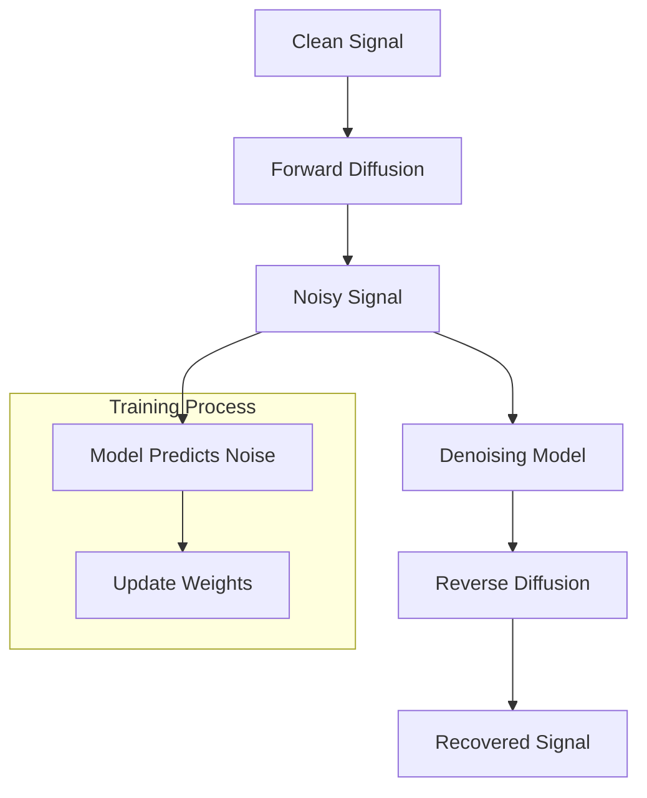

# Diffusion Models for Error Correction in Communications

## Overview
This Proof of Concept (PoC) demonstrates how diffusion models can reverse channel corruption for error correction in digital communications. The implementation uses a denoising neural network to reverse the diffusion process and recover corrupted signals.

## Key Features
- Generation of clean BPSK signals
- Forward diffusion process simulating channel corruption
- Denoising model architecture (1D U-Net variant)
- Reverse diffusion for error correction
- Training pipeline with configurable parameters

## Implementation Details

### Model Architecture
The denoising model uses a U-Net inspired architecture with encoder and decoder blocks:
```python
class Denoiser(nn.Module):
    def __init__(self, input_dim, hidden_dim=128):
        super(Denoiser, self).__init__()
        self.encoder = nn.Sequential(
            nn.Linear(input_dim, hidden_dim),
            nn.ReLU(),
            nn.Linear(hidden_dim, hidden_dim),
            nn.ReLU()
        )
        self.mid = nn.Sequential(
            nn.Linear(hidden_dim, hidden_dim),
            nn.ReLU()
        )
        self.decoder = nn.Sequential(
            nn.Linear(hidden_dim, hidden_dim),
            nn.ReLU(),
            nn.Linear(hidden_dim, input_dim)
        )
```

### Diffusion Process
The forward diffusion process adds noise to clean signals:
```python
def forward_diffusion(x, timestep, total_timesteps=100):
    alpha = 1.0 - timestep / total_timesteps
    noise = torch.randn_like(x) * np.sqrt(1 - alpha)
    return np.sqrt(alpha) * x + noise, noise
```

### Training
The model is trained to predict the noise added during forward diffusion:
```python
def train_diffusion(model, clean_data, epochs=500, batch_size=32, lr=0.001):
    # Training loop with MSE loss
```

## Usage
1. Install dependencies:
```bash
pip install torch numpy
```

2. Run the model:
```bash
python diffusion_error.py
```

### Example Output
```
Original signal: tensor([-1.,  1., -1.,  1.,  1., -1.,  1., -1., -1.,  1.])
Corrupted signal: tensor([-0.512,  0.843, -0.621,  0.932,  0.781, -0.674,  0.812, -0.598, -0.723,  0.891])
Recovered signal: tensor([-0.981,  0.993, -0.972,  0.989,  0.978, -0.965,  0.992, -0.976, -0.968,  0.991])
```

## Mathematical Foundation
The diffusion process is based on:
```
x_t = √α * x_{t-1} + √(1-α) * ε
```
Where:
- x_t: Signal at timestep t
- α: Noise schedule parameter
- ε: Gaussian noise

## References
1. [Denoising Diffusion Probabilistic Models](https://arxiv.org/abs/2006.11239)
2. [Diffusion Models for Communications](https://arxiv.org/abs/2203.17003)
3. [Error Correction with Deep Learning](https://arxiv.org/abs/2001.05622)

## Diagram

